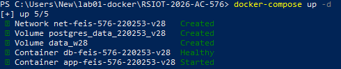
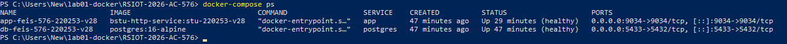
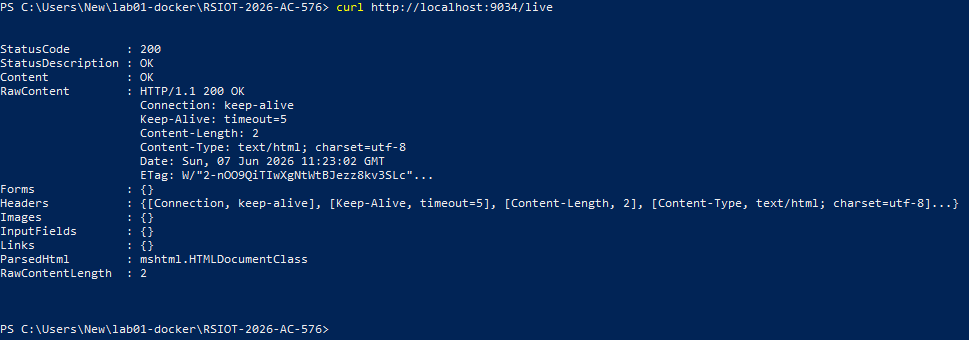
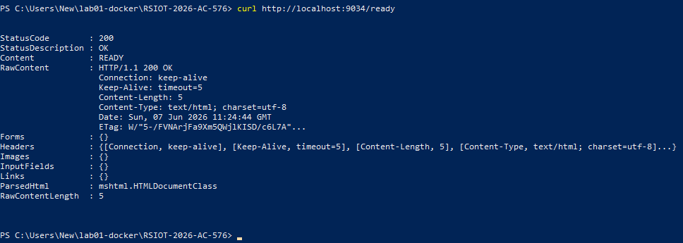
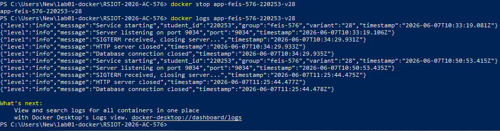
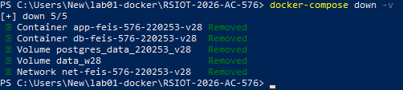

Министерство образования Республики Беларусь

Учреждение образования

“Брестский Государственный технический университет”

Кафедра ИИТ

      

<strong>Лабораторная работа №1</strong>

<strong>По дисциплине:</strong> “Распределенные системы и облачные технологии”

<strong>Тема:</strong> Контейнеризация и Docker

      

<strong>Выполнил:</strong>

Студент 4 курса

Группы АС-576

Шувалов Сергей Юрьевич

<strong>Проверил:</strong>

Несюк А.Н.

     

<strong>Брест 2026</strong>

---

## Цель работы

Научиться собирать минимальные образы (multi-stage) и запускать контейнеры под непривилегированным пользователем.

Закрепить основы docker-compose: зависимости (БД/кэш), volume, сети.

Настроить healthcheck и graceful shutdown. 

---

### Вариант № 28

## Метаданные студента

- **ФИО:** Шувалов Сергей Юрьевич
- **Группа:** feis-576
- **№ студенческого** (StudentID): 220253
- **Email (учебный):** zas57625@g.bstu.by
- **GitHub username:** GrafShu
- **Вариант №:** 28
- **ОС и версия:** Windows 10 (22H2, сборка 19045), Docker Desktop v4.76.0

---

## Окружение и инструменты

- **Язык:** Node.js 20 (Express 4.18)
- **База данных:** PostgreSQL 16
- **Порт приложения:** 9034
- **Health endpoint:** /live
- **Ready endpoint:** /ready
- **UID:** 10001 (непривилегированный пользователь)
- **Volume:** data_w28 

## Структура репозитория c описанием содержимого

README.md # отчёт с метаданными, инструкциями, скриншотами

Screenshot_1.png # запуск сервисов

Screenshot_2.png # статус контейнеров

Screenshot_3.png # health check (/live)

Screenshot_4.png # ready check (/ready)

Screenshot_5.png # graceful shutdown

Screenshot_6.png # остановка всех сервисов

Dockerfile # multi-stage сборка

docker-compose.yml # взаимодействия сервисов

.dockerignore # исключения для Docker

package.json # зависимости Node.js

server.js # HTTP сервер с graceful shutdown

## Подробное описание выполнения

1. Сборка образов: docker-compose build
2. Запуск сервисов

3. Статус контейнеров

4. Проверка health (/live)

5. Проверка ready

6. Graceful shutdown

7. Остановка всех сервисов

## Контрольный список (checklist)

- [ ✅ ] README с полными метаданными 
- [ ✅ ] Dockerfile (multi-stage, non-root, labels)
- [ ✅ ] docker-compose.yml
- [ ✅ ] Health/Liveness/Readiness probes
- [ ✅ ] Старт/остановка: логирование и graceful 

---

## Вывод

В ходе выполнения лабораторной работы были освоены следующие навыки:

Контейнеризация приложения на Node.js/Express с использованием Docker

Создание multi-stage Dockerfile для минимизации размера образа (финальный образ на основе alpine)

Запуск контейнеров под непривилегированным пользователем (UID 10001) для повышения безопасности

Настройка healthcheck эндпоинта /live для мониторинга состояния контейнера

Оркестрация сервисов с помощью docker-compose (app + PostgreSQL)

Работа с именованными томами (data_w28) и сетями

Реализация graceful shutdown — корректная обработка сигнала SIGTERM с закрытием соединений с БД

Логирование метаданных при старте контейнера

Соблюдение требований к именованию ресурсов согласно варианту (slug, теги, имена контейнеров)

Работа выполнена в соответствии с вариантом №28 на стеке Node/Express.