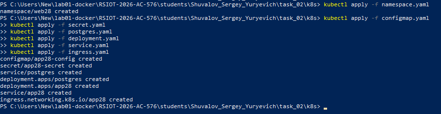
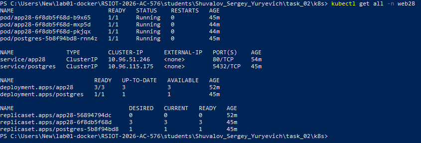
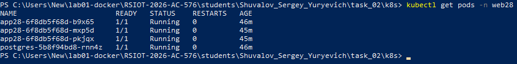
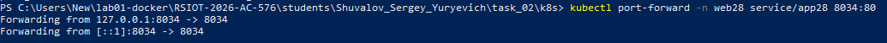
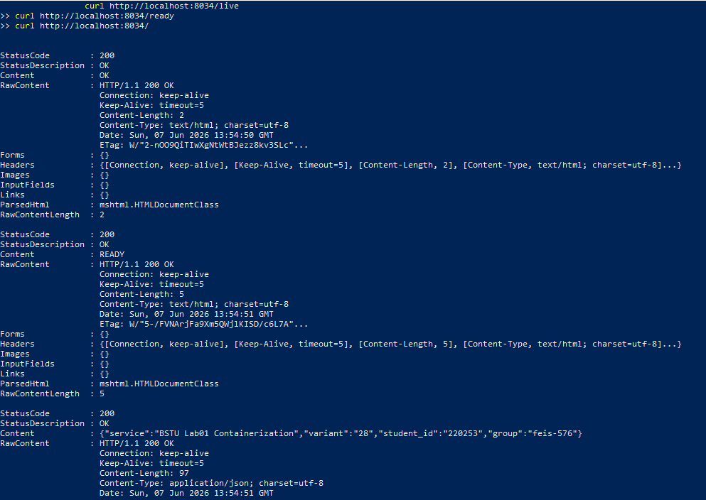
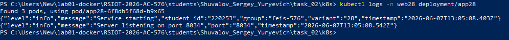
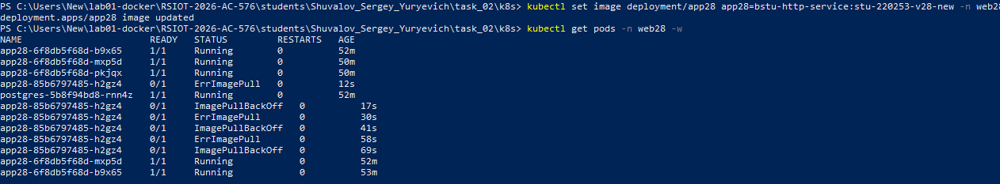
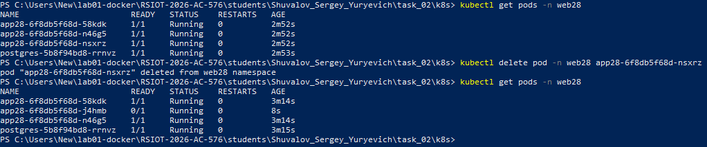
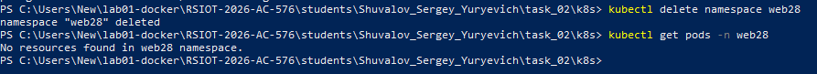
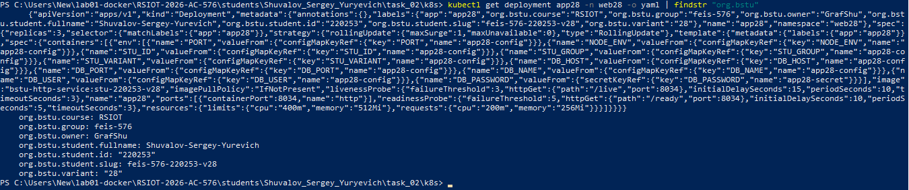

Министерство образования Республики Беларусь

Учреждение образования

“Брестский Государственный технический университет”

Кафедра ИИТ

      

<strong>Лабораторная работа №2</strong>

<strong>По дисциплине:</strong> “Распределенные системы и облачные технологии”

<strong>Тема:</strong> Kubernetes: базовый деплой

      

<strong>Выполнил:</strong>

Студент 4 курса

Группы АС-576

Шувалов Сергей Юрьевич

<strong>Проверил:</strong>

Несюк А.Н.

     

<strong>Брест 2026</strong>

---

## Цель работы

Научиться готовить Kubernetes-манифесты для простого HTTP-сервиса (Deployment + Service).

Настроить liveness/readiness probes и политику обновления (rolling update).

Подготовить конфигурацию через ConfigMap/Secret и смонтировать volume для данных при необходимости.

Научиться запускать кластер локально (Kind/Minikube) и проверять корректность деплоя.

---

### Вариант № 28

## Метаданные студента

- **ФИО:** Шувалов Сергей Юрьевич
- **Группа:** feis-576
- **№ студенческого** (StudentID): 220253
- **Email (учебный):** zas57625@g.bstu.by
- **GitHub username:** GrafShu
- **Вариант №:** 28
- **ОС и версия:** Windows 10 (22H2, сборка 19045), Docker Desktop v4.76.0

---

## Окружение и инструменты

- **Кластер:** Docker Desktop Kubernetes (Kind) v1.36.1
- **kubectl** - управление Kubernetes
- **Docker Desktop** - контейнеризация и встроенный Kubernetes
- **Ingress Controller:** nginx-ingress

## Структура репозитория c описанием содержимого

README.md # отчёт с метаданными, инструкциями, скриншотами

Screenshot_x.png # Скриншоты работы

namespace.yaml # Namespace web28

configmap.yaml # Конфигурация (PORT, STU_ID, STU_GROUP, STU_VARIANT, DB_*)

secret.yaml # Секрет с паролем БД

deployment.yaml # Deployment (3 реплики, RollingUpdate, probes, resources)

service.yaml # Service ClusterIP

ingress.yaml # Ingress (nginx, app28.local)

postgres.yaml # PostgreSQL зависимость

## Подробное описание выполнения

1. Создание и применение манифестов: kubectl apply -f.
Сначала создаём namespace, потом все остальное.

2. Проверка статусов всех ресурсов

3. Проверка статуса подов

4. Проверка работы приложения

5. Проверка логов

6. Rolling update

Kubernetes создаёт новый под (ErrImagePull) перед удалением старых, что соответствует стратегии RollingUpdate

7. Graceful shutdown

8. Очистка ресурсов

9. Проверка метаданных в Kubernetes

## Контрольный список (checklist)

- [ ✅ ] README с полными метаданными
- [ ✅ ] Namespace web28
- [ ✅ ] ConfigMap + Secret
- [ ✅ ] Deployment (3 реплики, RollingUpdate)
- [ ✅ ] Service ClusterIP
- [ ✅ ] Ingress (nginx)
- [ ✅ ] PostgreSQL зависимость
- [ ✅ ] livenessProbe + readinessProbe
- [ ✅ ] resources (requests/limits)
- [ ✅ ] Метаданные в labels
- [ ✅ ] Port-forward проверка
- [ ✅ ] Логирование метаданных
- [ ✅ ] Graceful shutdown
- [ ✅ ] Rolling Update без простоя

---

## Вывод

В ходе выполнения лабораторной работы №2 были освоены следующие навыки:

Подготовка Kubernetes-манифестов
Созданы манифесты для развертывания HTTP-сервиса: Namespace web28, Deployment с 3 репликами и стратегией RollingUpdate (maxUnavailable=0, maxSurge=1), Service типа ClusterIP и Ingress с ingressClassName: nginx.

Конфигурация приложения
Настроена передача конфигурации через ConfigMap (PORT, STU_ID, STU_GROUP, STU_VARIANT, параметры БД) и Secret для безопасного хранения пароля PostgreSQL.

Probes и управление ресурсами
Реализованы livenessProbe и readinessProbe (HTTP, порт 8034) для мониторинга состояния приложения. Установлены requests (cpu=200m, memory=256Mi) и limits (cpu=400m, memory=512Mi) для управления ресурсами.

Развертывание зависимостей
Развернута база данных PostgreSQL в виде отдельного Deployment с Service для обеспечения сетевой связности.

Метаданные и именование
В манифесты добавлены необходимые labels: org.bstu.student.fullname, org.bstu.student.id, org.bstu.group, org.bstu.variant, org.bstu.course, org.bstu.owner, org.bstu.student.slug (feis-576-220253-v28).

Проверка работоспособности
Доступ к приложению проверен через kubectl port-forward и curl-запросы к эндпоинтам /live, /ready и /. Выполнен Rolling Update без простоя. Подтвержден graceful shutdown с корректной обработкой сигнала SIGTERM и закрытием соединения с базой данных.

Работа выполнена в соответствии с вариантом №28.