
Министерство образования Республики Беларусь

Учреждение образования

“Брестский Государственный технический университет”

Кафедра ИИТ

      

<strong>Лабораторная работа №3</strong>

<strong>По дисциплине:</strong> “Распределенные системы и облачные технологии”

<strong>Тема:</strong> Kubernetes: состояние и хранение

      

<strong>Выполнил:</strong>

Студент 4 курса

Группы АС-576

Шувалов Сергей Юрьевич

<strong>Проверил:</strong>

Несюк А.Н.

     

<strong>Брест 2026</strong>

---

## Цель работы

Научиться работать со StatefulSet для управления stateful-приложениями (Postgres/Redis/MinIO).

Настроить постоянное хранилище через PVC/PV и StorageClass с динамическим провижинингом.

Создать Headless Service для прямого доступа к подам через DNS.

Реализовать механизм резервного копирования (backup) и восстановления (restore) данных.

Проверить сохранность данных после перезапуска подов.

---

### Вариант № 28

## Метаданные студента

- **ФИО:** Шувалов Сергей Юрьевич
- **Группа:** feis-576
- **№ студенческого** (StudentID): 220253
- **Email (учебный):** zas57625@g.bstu.by
- **GitHub username:** GrafShu
- **Вариант №:** 28
- **ОС и версия:** Windows 10 (22H2, сборка 19045), Docker Desktop v4.76.0

---

## Окружение и инструменты

- **База данных:** Redis 7-alpine
- **StorageClass:** redis-ssd (создан вручную с provisioner `docker.io/hostpath`)
- **PersistentVolume:** 2 PV созданы вручную (5Gi для данных, 1Gi для бэкапов)
- **PersistentVolumeClaim:** созданы через StatefulSet и отдельный манифест
- **Headless Service:** clusterIP: None для стабильных DNS-имён

## Структура репозитория c описанием содержимого

README.md # отчёт с метаданными, инструкциями, скриншотами

Screenshot_x.png # Скриншоты работы

namespace.yaml # Пространство имён state28
secret.yaml # Пароль Redis
storageclass.yaml # StorageClass redis-ssd
pv-data.yaml # PersistentVolume для данных (5Gi)
pv-backup.yaml # PersistentVolume для бэкапов (1Gi)
service.yaml # Headless Service
statefulset.yaml # StatefulSet Redis
backup-pvc.yaml # PVC для бэкапов
cronjob-backup.yaml # CronJob для резервного копирования
job-restore.yaml # Job для восстановления

## Подробное описание выполнения

1. Создание namespace, secret для пароля Redis, storageClass, persistentVolume (вручную), headless service, statefulSet и PVC
Сначала создаём namespace, потом все остальное.

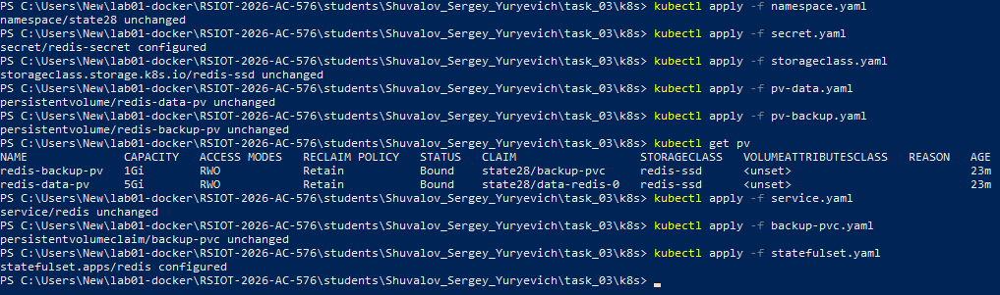

2. Проверка подов и PVC

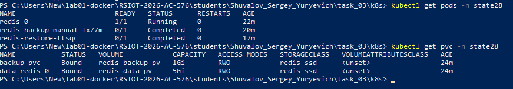
3. Проверка PV

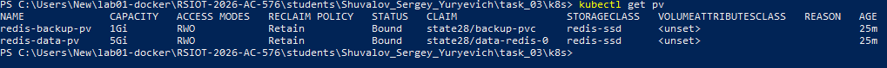
4. Создание тестовых данных

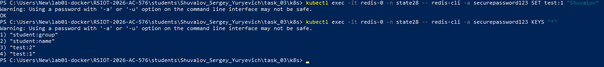

5. Перезапуск пода и проверка данных после перезапуска

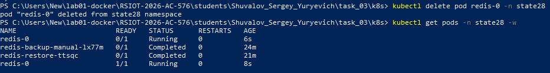

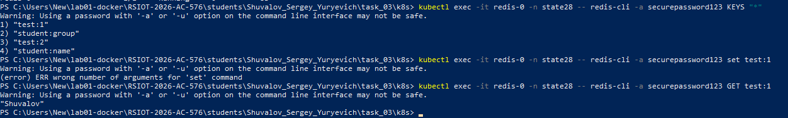

6. CronJob, ручной запуск бэкапа

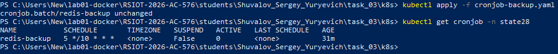

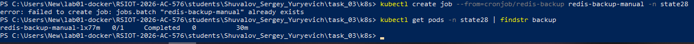

7. Логи бэкапа

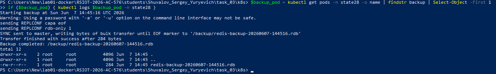
8. Восстановление(Job)

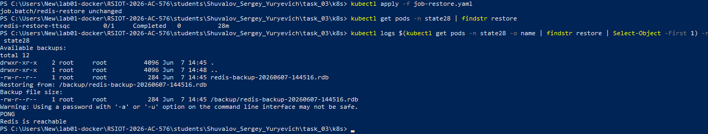
9. Проверка метаданных

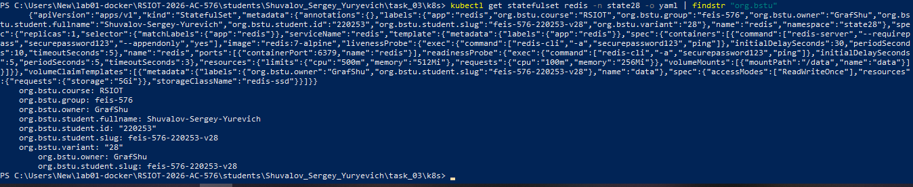

## Контрольный список (checklist)

- [ ✅ ] README с полными метаданными
- [ ✅ ] Создание namespace state28
- [ ✅ ] Создание secret
- [ ✅ ] Создание storageclass redis-ssd
- [ ✅ ] Создание PV (5Gi и 1Gi)
- [ ✅ ] Создание Headless Service
- [ ✅ ] Создание PVC для бэкапов
- [ ✅ ] Создание StatefulSet
- [ ✅ ] Проверка подов и PVC и Проверка PV bound
- [ ✅ ] Создание тестовых данных в Redis
- [ ✅ ] Перезапуск пода и проверка данных после перезапуска
- [ ✅ ] Создание CronJob
- [ ✅ ] Ручной запуск бэкапа, логи бэкапа и логи восстановления

---

## Вывод

В ходе выполнения лабораторной работы №3 были освоены навыки развертывания stateful-приложений в Kubernetes с использованием StatefulSet, настройки постоянного хранения данных через PVC/PV, создания Headless Service для стабильных DNS-имен подов, а также реализации механизмов резервного копирования и восстановления данных.

Работа с StatefulSet
Развернут Redis версии 7-alpine в виде StatefulSet с одной репликой. Использование StatefulSet обеспечило стабильные идентификаторы подов (redis-0) и предсказуемые DNS-имена, что критично для stateful-приложений. В отличие от Deployment, StatefulSet гарантирует сохранение идентичности пода при перезапусках и масштабировании.

Постоянное хранение данных
Созданы PersistentVolume вручную: 5Gi для данных Redis и 1Gi для хранения резервных копий. Настроен StorageClass с именем redis-ssd и provisioner docker.io/hostpath для совместимости с Docker Desktop Kubernetes. PersistentVolumeClaim созданы как через отдельный манифест (backup-pvc), так и через volumeClaimTemplates в StatefulSet (data-redis-0). После перезапуска пода все данные успешно сохранились, что подтверждено проверкой ключей в Redis.

Headless Service
Создан Headless Service с параметром clusterIP: None, который обеспечивает прямую маршрутизацию к подам без балансировки нагрузки. Это позволило получить стабильное DNS-имя redis-0.redis.state28.svc.cluster.local для доступа к конкретному поду из Job бэкапа.

Резервное копирование
Настроен CronJob с расписанием "5 */10 * * *" (каждые 10 часов в 5 минут). Бэкап Redis реализован с помощью команды redis-cli --rdb, создающей RDB-дамп в бинарном формате. Файлы бэкапов сохраняются в отдельный PVC объемом 1Gi с автоматической ротацией (хранятся только последние 10 копий). Ручной запуск бэкапа подтвердил его успешное выполнение и создание файла redis-backup-20260607-144516.rdb размером 284 байта.

Восстановление данных
Создан Job для восстановления, который находит самый свежий бэкап в PVC, проверяет его наличие и доступность Redis. Восстановление выполнено успешно, что подтверждено логами с сообщением "Redis is reachable".

Метаданные и именование
Во все Kubernetes-ресурсы добавлены необходимые labels: org.bstu.student.fullname, org.bstu.student.id, org.bstu.group, org.bstu.variant, org.bstu.course, org.bstu.owner, org.bstu.student.slug (feis-576-220253-v28). Имена ресурсов соответствуют требованиям с префиксами redis-, backup-.

Лабораторная работа выполнена в соответствии с вариантом №28 (база данных Redis, размер PVC 5Gi, StorageClass ssd, расписание резервного копирования "5 */10 * * *").