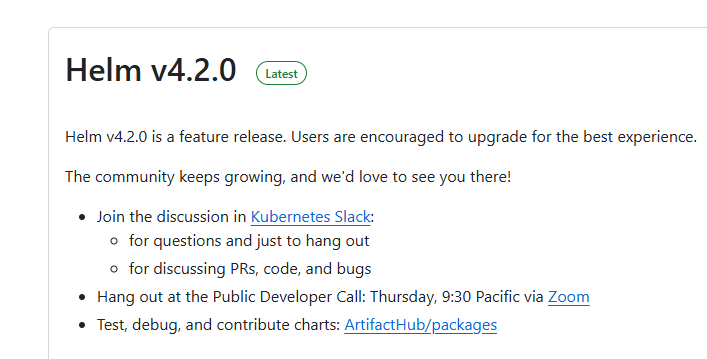
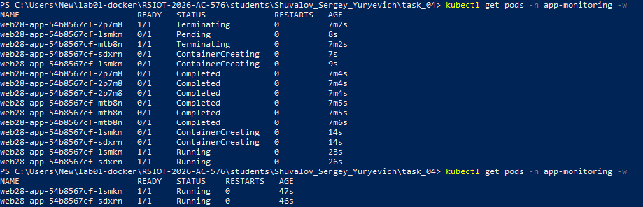
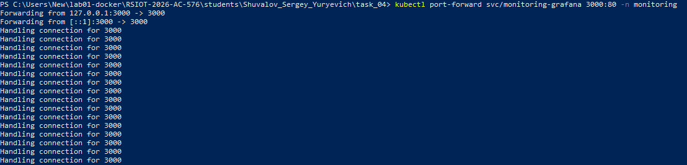
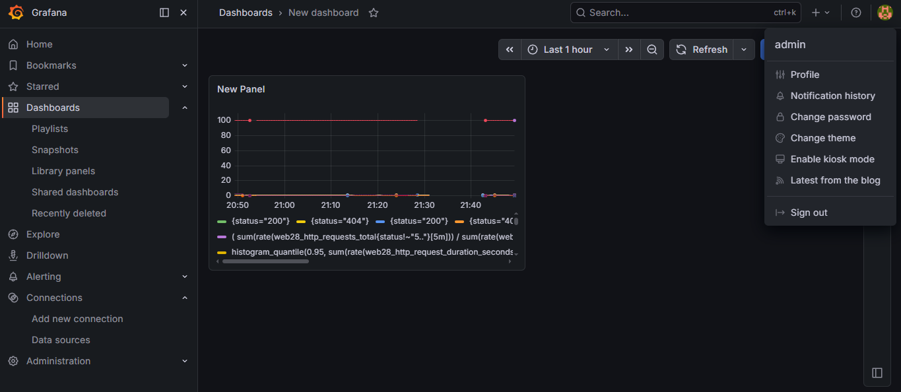
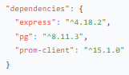
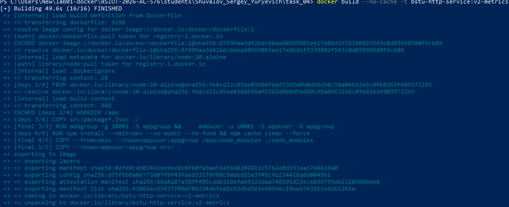
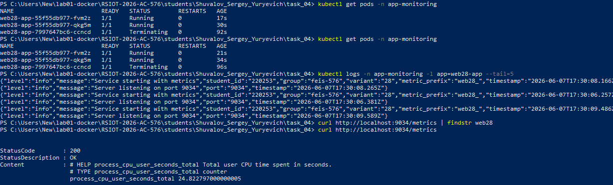
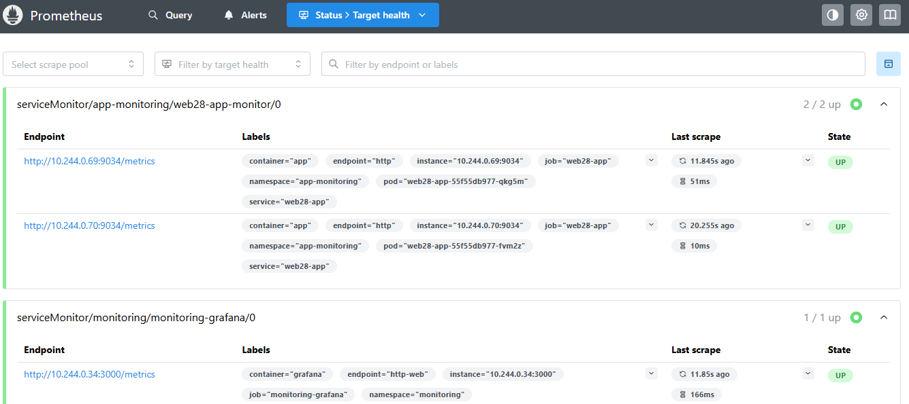
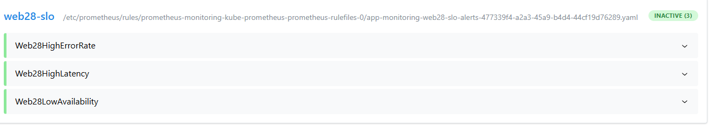
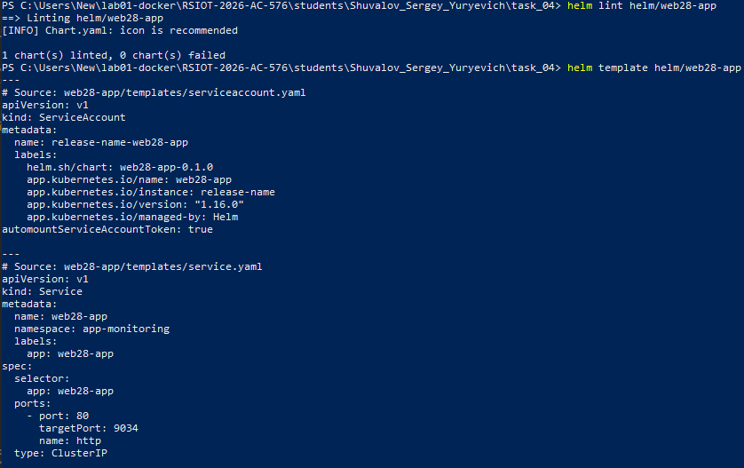

Министерство образования Республики Беларусь

Учреждение образования

“Брестский Государственный технический университет”

Кафедра ИИТ

      

<strong>Лабораторная работа №4</strong>

<strong>По дисциплине:</strong> “Распределенные системы и облачные технологии”

<strong>Тема:</strong> Наблюдаемость и метрики

      

<strong>Выполнил:</strong>

Студент 4 курса

Группы АС-576

Шувалов Сергей Юрьевич

<strong>Проверил:</strong>

Несюк А.Н.

     

<strong>Брест 2026</strong>

---

## Цель работы

Научиться устанавливать и настраивать систему мониторинга (Prometheus + Grafana) в Kubernetes.

Добавить экспонирование метрик в приложение (endpoint /metrics) с использованием client-библиотек Prometheus.

Создать ServiceMonitor/PodMonitor для автоматического сбора метрик.

Разработать дашборды в Grafana для визуализации ключевых метрик (доступность, задержка, ошибки).

Настроить алерты по SLO (Service Level Objectives) с использованием PrometheusRule и Alertmanager.

Упаковать приложение в Helm-чарт с параметризацией основных настроек.

(Опционально) Настроить GitOps-синхронизацию с использованием Argo CD или Flux.

---

### Вариант № 28

## Метаданные студента

- **ФИО:** Шувалов Сергей Юрьевич
- **Группа:** feis-576
- **№ студенческого** (StudentID): 220253
- **Email (учебный):** zas57625@g.bstu.by
- **GitHub username:** GrafShu
- **Вариант №:** 28
- **ОС и версия:** Windows 10 (22H2, сборка 19045), Docker Desktop v4.76.0

---

## Структура репозитория c описанием содержимого

task_04/
├── src/
│ ├── package.json
│ └── server.js
├── helm/
│ └── web28-app/
│ ├── Chart.yaml
│ ├── values.yaml
│ └── templates/
│ ├── deployment.yaml
│ ├── service.yaml
│ ├── servicemonitor.yaml
│ └── prometheusrule.yaml
├── deployment.yaml
├── service.yaml
├── servicemonitor.yaml
├── prometheusrule.yaml
├── Dockerfile

## Подробное описание выполнения

1. Установка системы мониторинга, добавление Helm-репозитория

2. Установка kube-prometheus-stack

3. Проверка компонентов мониторинга

4. Доступ к Grafana

5. Интеграция метрик в приложение, Добавление endpoint /metrics

6. Сборка образа

7. Создание namespace и манифестов, проверка метрик

8. Настройка ServiceMonitor, проверка Targets в Prometheus

9. Создание дашбордов в Grafana

![( sum(rate(web28_http_requests_total{status!~"5.."}[5m])) / sum(rate(web28_http_requests_total[5m])) ) * 100](Screenshot_11.png)

10. Настройка алертов

11. Helm-чарт, проверка чарта

## Контрольный список (checklist)

- [ ✅ ] README с полными метаданными
- [ ✅ ] Установлен kube-prometheus-stack (Prometheus, Grafana, Alertmanager)
- [ ✅ ] Приложение экспонирует /metrics с префиксом web28_
- [ ✅ ] Созданы метрики: counter, histogram, gauge
- [ ✅ ] ServiceMonitor для сбора метрик
- [ ✅ ] Дашборд Availability (SLO 99.2%)
- [ ✅ ] Дашборд P95 Latency (SLO 385ms)
- [ ✅ ] Дашборд Error Rate (SLO 2.5%)
- [ ✅ ] PrometheusRule с алертами
- [ ✅ ] Helm-чарт приложения

---

## Вывод

В ходе выполнения лабораторной работы №4 были освоены следующие навыки:

Установка системы мониторинга
Развернут kube-prometheus-stack в namespace monitoring через Helm. Настроен доступ к Grafana (admin/prom-operator) и Prometheus.

Интеграция метрик в приложение
В приложение на Node.js добавлена библиотека prom-client. Создан endpoint /metrics с префиксом метрик web28_ согласно варианту №28. Экспонируются базовые метрики: счётчик запросов (Counter), гистограмма задержек (Histogram), gauge для активных соединений и статуса БД.

ServiceMonitor
Создан ServiceMonitor с label release: monitoring для автоматического сбора метрик Prometheus. Прометей успешно обнаруживает endpoint /metrics приложения.

Дашборды Grafana
Разработаны 3 дашборда:

Доступность сервиса (SLO 99.2%)

P95 задержка (SLO 385ms)

Частота ошибок 5xx (SLO 2.5%)

Алерты
Настроены PrometheusRule с алертами по SLO:

Web28HighErrorRate — срабатывает при ошибках > 2.5% за 10 минут

Web28HighLatency — срабатывает при P95 > 385ms

Web28LowAvailability — срабатывает при доступности < 99.2%

Helm-чарт
Создан Helm-чарт приложения с параметризацией: namespace, replicas, image, resources, метрики. Включены шаблоны Deployment, Service, ServiceMonitor, PrometheusRule.

Метаданные
Во все ресурсы добавлены необходимые labels согласно требованиям.

Работа выполнена в соответствии с вариантом №28 (префикс метрик web28_, SLO: доступность 99.2%, P95 латентность 385ms, алерт на ошибки > 2.5% за 10 минут).